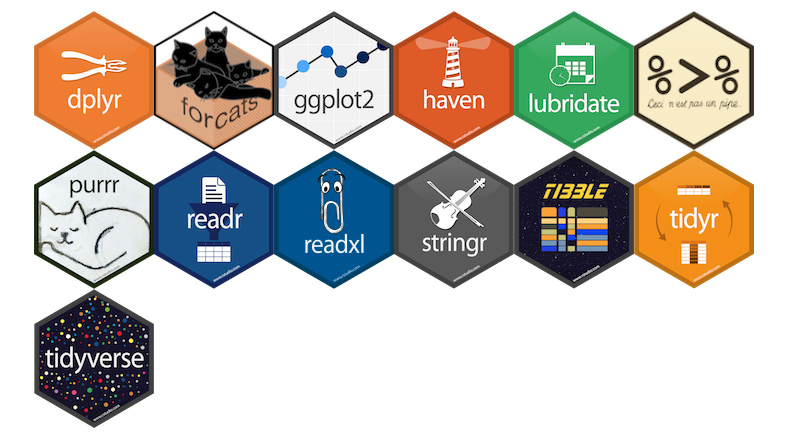

## What is R?


> R is a free software environment for statistical computing and graphics. It compiles and runs on a wide variety of UNIX platforms, Windows and MacOS. ([r-project.org](<https://www.r-project.org/>))

::: {.column-margin} 

Install R from <https://cran.rstudio.com/>

::: 

## Short introduction to the language

> To understand computations in R, two slogans are helpful:
>
> -   Everything that exists is an object.\
> -   Everything that happens is a function call.
>
> ::: {style="text-align: right;"}
> -- John Chambers (creator of the S programming language)
> :::


::: {.column-margin}

For comprehensive introductions

- [R Manual](https://cran.r-project.org/doc/manuals/r-release/R-intro.html) on the [CRAN](https://cran.r-project.org) website

- [The R Manuals](https://rstudio.github.io/r-manuals/): A re-styled version of the original R manuals

- [R for Data Science](<https://r4ds.had.co.nz/>) by Hadley Wickham and Garrett Grolemund

- [Hands-On Programming with R](<https://rstudio-education.github.io/hopr/>) by Garrett Grolemund


:::


### Some Basics

Before looking at the data types and structures, there are a few basics you need to know.


:::: {.columns}

::: {.column style="padding-top: 1em; width: 49%"}

- R has a **help system** to get help on functions and packages

:::

::: {.column width="2%"}
<!-- empty column to create gap -->
:::

::: {.column width="49%"}

```{r}
#| label: r-help
#| eval: false
#| code-fold: false
#| code-line-numbers: false

help("mean")
# or aquivalently
?mean
```


:::

::::

:::: {.columns}

::: {.column style="padding-top: 1em; width: 49%"}

-  R is a **calculator** 

:::

::: {.column width="2%"}
<!-- empty column to create gap -->
:::

::: {.column width="49%"}

```{r}
#| label: r-calc
#| code-fold: false
#| code-line-numbers: false

sqrt(25) + 2^2
```

:::

::::


:::: {.columns}

::: {.column style="padding-top: 1em; width: 49%"}

- R is **case-sensitive**

:::

::: {.column width="2%"}
<!-- empty column to create gap -->
:::

::: {.column width="49%"}

```{r}
#| label: case-sense
#| code-fold: false
#| code-line-numbers: false

"name" == "Name"
```

:::

::::


:::: {.columns}

::: {.column style="padding-top: 1em; width: 49%"}

- **Values** can be assigned to **objects** using `<-`

:::

::: {.column width="2%"}
<!-- empty column to create gap -->
:::

::: {.column width="49%"}

```{r}
#| label: r-assign
#| eval: true
#| code-fold: false
#| code-line-numbers: true
a <- 2
b <- 4
a + b
```

:::

::::


:::: {.columns}

::: {.column style="padding-top: 1em; width: 49%"}

- **Arguments** in functions are assigned using `=`

:::

::: {.column width="2%"}
<!-- empty column to create gap -->
:::

::: {.column width="49%"}

```{r}
#| label: r-arg
#| eval: true
#| code-fold: false
#| code-line-numbers: true
df <- data.frame(
  x = 1:4,
  y = 3:6
)

```

:::

::::


### Data Types

The basic data types in R are depicted in @tbl-data-type-R.

+-------------------+-------------------------------------------+-----------------------+
| Type              | Description                               | Value (example)       |
+:==================+:==========================================+=======================+
| **Numeric**       | Numbers with decimal value or fraction    | `3.7`                 |
+-------------------+-------------------------------------------+-----------------------+
| **Integer**       | Counting numbers and their additive       | `2`, `-115`           |
|                   | inverses                                  |                       |
+-------------------+-------------------------------------------+-----------------------+
| **Character**     | Letters enclosed by quotes                | `"Hello World!"`,`"4"`|
|                   | in the output (aka string)                |                       |
+-------------------+-------------------------------------------+-----------------------+
| **Logical**       | boolean                                   | `TRUE`, `FALSE`       |
+-------------------+-------------------------------------------+-----------------------+
| **Factor**        | Categorial data \                         |   \                   |
|                   | - *Level:* characteristic value           |   `0`, `1` \          |
|                   |             as seen by R  \               |  `male`,`female`      |
|                   | - *Label:* designation of the             |                       |
|                   |             characteristic attributes     |                       |
+-------------------+-------------------------------------------+-----------------------+
| **Complex**[^1]   | numbers with a real and an imaginary part | `2 + 3i`              |
+-------------------+-------------------------------------------+-----------------------+
| **Special**       | - *Missing values:* unknown cell value    |   `NA` \              |
|                   | - *Impossible values:* not a number       |   `NaN` \             |
|                   | - *Empty values:* known empty             |   `NULL`              |
|                   |                   cell value              |                       |
+-------------------+-------------------------------------------+-----------------------+

: Basic data types in  {#tbl-data-type-R}

[^1]: "In mathematics, a complex number is an element of a number system that extends the real numbers with a specific element denoted i, called the imaginary unit and satisfying the equation $i^2 = -1$; every complex number can be expressed in the form $a+bi$, where a and b are real numbers." ([wikipedia](<https://en.wikipedia.org/wiki/Complex_number>))


<br>

:::: {.columns}

::: {.column width="49%"}

You can check the class of an object with the `class()` function.


:::

::: {.column width="2%"}

:::

::: {.column width="49%"}

```{r}
#| label: r-class
#| code-line-numbers: false

class(a)
class(df)
```

:::

::::

### Data Structures {#data-structure}

R has five^[In addition, factors are a special data type used to represent categorical variables.] *fundamental* data structures: vectors, matrices, arrays, lists, and data frames. 


::: {.panel-tabset .column-body-outset}

#### Vector

:::: {.columns}

::: {.column width="45%"}


A **vector** is...

-  an one-dimensional array and 
-  the elements are of the same data type (here: numeric/integer)

:::

::: {.column width="2%"}
<!-- empty column to create gap -->
:::

::: {.column width="53%"}

<br>

```{r}
#| label: demo-vec-intro

vec <- c(45, 6, -83)
vec
```

:::

::::


::: {.callout-tip collapse="true" appearance="simple" title="More on Handling Vectors"}

Create a vector with the `c()` function

```{r}
#| label: demo-vec-0
#| code-fold: false
v <- c(45, 6, -83, 23, 61)
v
```

Or a named vector...

```{r}
#| label: demo-vec-1
#| code-fold: false
vNam <- c(a = 45, b = 6, c = -83, d = 23, e = 61)
vNam
```

Count the elements of items contained in vector

```{r}
#| label: demo-vec-2
#| code-fold: false
length(v)
```

Vector indexing (by position)

```{r}
#| label: demo-vec-3
#| code-fold: false

v[1]
v[-3]
```

Slicing vectors

```{r}
#| label: demo-vec-4
#| code-fold: false
v[3:5]
```

Generate regular sequences using `seq` function

```{r}
#| label: demo-seq-4
#| code-fold: false
seq(from = 0,
    to = 20,
    by = 2)
```

:::


#### Matrix

:::: {.columns}

::: {.column width="45%"}

A **matrix** is...

- an two-dimensional array (rows and columns) and
- the elements are of the same data type (here: numeric/integer)


:::

::: {.column width="2%"}
<!-- empty column to create gap -->
:::

::: {.column width="53%"}

<br>

```{r}
#| label: demo-mat-intro
matrix(
  data = c(1, 2, 3, 45),
  nrow = 2,
  ncol = 2,
  byrow = TRUE
 )
```

:::

::::

::: {.callout-tip collapse="true" appearance="simple" title="More on Handling Matrices"}

The `matrix()` function creates a matrix from the given set of values

```{r}
#| label: demo-mat-0
#| code-fold: false
m <- matrix(data = c(1, 2, 3, 45, 36, 52),
            nrow = 2,
            ncol = 3,
            byrow = TRUE)
m
```

Slicing works also on matrices: `m[row , column]`

```{r}
#| label: mat-slice
#| code-fold: false
#| code-line-numbers: false
m[, 1:2]
```

:::

#### Array

:::: {.columns}

::: {.column width="45%"}

An **array** is...

- a multi-dimensional data structure and
- the elements must be of the same data type

Dimensions can be 2D (matrix), 3D, or higher (see [cran.r-project.org/doc/manuals](https://cran.r-project.org/doc/manuals/r-release/R-intro.html#Arrays))

:::

::: {.column width="2%"}
<!-- empty column to create gap -->
:::

::: {.column width="53%"}

<br>

```{r}
#| label: demo-array-intro

arr <- array(1:12,
             dim = c(3, 4))
arr
```

:::

::::


::: {.callout-tip collapse="true" appearance="simple" title="More on Handling Arrays"}

Create an array with the array function (here 3×4 matrix):

```{r}
#| label: demo-arr-0
#| code-fold: false
arr <- array(1:12, dim = c(3, 4))
arr
```

A 3D array (2 “sheets” of 3×4):

```{r}
#| label: demo-arr-1
#| code-fold: false
arr3d <- array(1:24, dim = c(3, 4, 2))
arr3d
```

Check the dimensions:

```{r}
#| label: demo-arr-2
#| code-fold: false
dim(arr3d)
```

Indexing (row, column, layer):

```{r}
#| label: demo-arr-3
#| code-fold: false

arr3d[2, 3, 1]   # element in row 2, col 3, layer 1
arr3d[ , , 2]  # layer 2
```

Slicing across dimensions:

```{r}
#| label: demo-arr-4
#| code-fold: false
arr3d[1:2, , ]
```

:::

#### List

:::: {.columns}

::: {.column width="45%"}

A **list** is ...

- an ordered collection of elements (order is preserved), and
- can contain elements of various data types


Lists are one-indexed (indexing starts with 1), which means that the first element of a list is accessed with index 1, not 0.


:::

::: {.column width="2%"}
<!-- empty column to create gap -->
:::

::: {.column width="53%"}

<br>

```{r}
#| label: demo-list-intro
#| code-line-numbers: false
list("hi", 2, NULL)
```

:::

::::

::: {.callout-tip collapse="true" appearance="simple" title="More on Handling Lists"}

Create lists (with different elements, i.e., numbers and letters) with the `list()` function

```{r}
#| label: demo-list-0
#| code-fold: false
l1 <- list(1:5)
l2 <- list(letters[1:5])
l3 <- list(LETTERS[1:5])
```

Create a nested list...

```{r}
#| label: demo-list-1
#| code-fold: false
#| code-line-numbers: false
l4 <- list(l1, l2, l3)
l4
```

...or a named (nested) list

```{r}
#| label: demo-list-2
#| code-fold: false
l4Nam <- list("Numbers" = l1,
              "SmallLetters" = l2,
              "CaptialLetters" = l3)
l4Nam
```

Access list or nested list elements

```{r}
#| label: demo-list-3
#| code-fold: false
#| code-line-numbers: false
l4[2]
l4[[2]][3]
```

Unlist the `list` to get vector which contains all the atomic components

```{r}
#| label: demo-list-4
#| code-fold: false
#| code-line-numbers: false
unlist(l1)
unlist(l4)
```

Count amount of items contained in list

```{r}
#| label: demo-list-5
#| code-fold: false
#| code-line-numbers: false
length(l4)
length(unlist(l4))
```

:::

You might want to check 

#### Data frames

:::: {.columns}

::: {.column width="45%"}

A **data frame** ...

- consists of multiple columns, and
- each column may have a different data type

Usually, variables are stored in columns and units in rows.


:::

::: {.column width="2%"}
<!-- empty column to create gap -->
:::

::: {.column width="53%"}

<br>

```{r}
#| label: demo-df-intro
#| code-fold: false

data.frame(
  id = 1:4,
  age = c(12, 13, 12, 14),
  sex = c("male", "female", "female", "male")
)
```

:::

::::

::: {.callout-tip collapse="true" appearance="simple" title="More on Handling Data Frames"}

```{r}
#| label: demo-df-0
#| code-fold: false
ex_df <- data.frame(
  id = 1:4,
  age = c(12, 13, 12, 14),
  sex = c("male", "female", "female", "male")
)
ex_df
```

Number of observations

```{r}
#| label: demo-df-1
#| code-fold: false
#| code-line-numbers: false
nrow(ex_df)
```

Show dimension (rows, columns) of dataframe 

```{r}
#| label: demo-df-2
#| code-fold: false
#| code-line-numbers: false
dim(ex_df)
```

Column names

```{r}
#| label: demo-df-3
#| code-fold: false
#| code-line-numbers: false
colnames(ex_df)
```

Show the first two rows of the dataframe

```{r}
#| label: demo-df-4
#| code-fold: false
#| code-line-numbers: false
head(ex_df, 2)
```


:::

:::

<br>


The **structure** of an object can be checked using the `str()` function.


```{r}
#| label: r-structure
#| code-line-numbers: false

str(vec) 
str(ex_df)
```


## Base , Additional Packages and tidyverse {#baseR-tidyverse}

R has a large ecosystem of libraries (often called packages) that extend the functionality of base R. Base R itself consists of a set of packages that are loaded by default when you start an R session. These can be checked with the `sessionInfo()` function.

::: {.column-margin}

<https://cran.r-project.org/>

:::

```{r}
#| label: r-base-pkgs
#| code-line-numbers: false
sessionInfo()$basePkgs

```

On the Comprehensive R Archive Network (CRAN), there are *innumerable* packages available that can be installed and loaded to add specific functionalities such as enhanced data manipulation, specific data analyses (e.g., linear mixed models, structural equation modeling), or data visualization to R. The following example demonstrates how to install a package (i.e., `ggplot2` for data visualization) from CRAN, and load it into a R session.

```{r}
#| label: install-load
#| eval: false

install.packages("ggplot2") 
library(ggplot2) 

```

::: {.callout-note title="Modern package manager for R"}

You might also want to consider using the `pak` package [@R-pak] for installing packages. `pak` is a modern package manager and is a faster, a more efficient (e.g., regarding dependency management) and a more user-friendly (e.g., improved error handling) way to install and manage R packages than the `install.packages()` function.

:::

For educational research, you may be interested in the following list of packages that are well established and can be used *without concerns* regarding their reliability and maintenance:

- dplyr [@R-dplyr] for data manipulation (see also below)
- psych [@R-psych] for psychometric analyses
- survey [@R-survey] for complex survey analysis
- lme4 [@R-lme4] for linear mixed-effects models
- lavaan [@R-lavaan] for structural equation modeling
- ggplot2 [@R-ggplot2] for data visualization
- ...


Finally, there is the so-called `tidyverse` [@R-tidyverse] within R. The `tidyverse` is a collection of R packages (see @fig-tidyverse) that *"share an underlying design philosophy, grammar, and data structures"* and are (specifically) designed for data science.

::: {.column-margin}

See <https://www.tidyverse.org/>

:::

{#fig-tidyverse width=80%}


Within the `tidyverse` package collection, the `dplyr` package [@R-dplyr] provides a set of convenient functions for manipulating data. Together with the pipe operator `%>%` from the `magrittr` package [@R-magrittr], it is an extremely powerful approach to manipulate data in a clear and comprehensible way. The native^[for the initial difference between `|>` and `%>%` see <https://ivelasq.rbind.io/blog/understanding-the-r-pipe/>] R pipe `|>` was introduced with R [v4.1.0](https://cran.r-project.org/bin/windows/base/old/4.1.0/NEWS.R-4.1.0.html) and since [R 4.3.0](https://cran.r-project.org/bin/windows/base/old/4.3.0/NEWS.R-4.3.0.html), the base pipe provides all the features from `magrittr`.

::: {#what-is-pipe-op .callout-tip collapse="true" title="What does the pipe operator |> do?"}

[The tidyverse style guide](https://style.tidyverse.org/) suggests using the pipe operator *"to emphasize a sequence of actions"*. The pipe operator can be understood as *"take the object and then"* pass it to the next function. To illustrate the idea behind the pipe operator, we will use the following example dataset (`ex_dat`) which contains two numeric variables (`X` and `Y`).

```{r}
#| label: demo-pipe-data
#| code-fold: show

ex_dat <- data.frame(
  X = rnorm(100, mean = 2, sd = 1),
  Y = rnorm(100, mean = 3, sd = 1) 
)
```


In the following, the use of the base R pipe operator is demonstrated through a simple table creatation example.

```{r}
#| label: demo-pipe-1
#| code-fold: false
#| code-line-numbers: true

ex_dat |>  #<1>
  dplyr::select(X, Y) |>      #<2>
  psych::describe(fast=TRUE) |>  #<3>
  knitr::kable(digits = 2)       #<4>
```

1. **Take** the data frame `ex_dat` **and then** 
2. Select the variables: `X` and `Y` **and then**
3. Calculate descriptive statistics using the `describe` function from the `psych` package [@R-psych] **and then**
4. Create a table with the `kable` function from the `knitr` package [@R-knitr]


<br>


If you are convinced by the pipe approach, you can stop reading here and jump to the next section [More about R Programming](#more-about-r). If not, let us compare the pipe approach with two alternative ways to write the same code:

- a nested approach

- a sequential approach

The **nested approach** looks like this:

```{r}
#| label: demo-pipe-2
#| code-fold: false
#| code-line-numbers: false
#| eval: false

knitr::kable(psych::describe(ex_dat[, c("X", "Y")], fast=TRUE), digits = 2) 
```

...or, formatted:

```{r}
#| label: demo-pipe-3
#| code-fold: false
#| code-line-numbers: true
#| eval: false
knitr::kable(
  psych::describe(ex_dat[, c("X", "Y")],
                  fast=TRUE),
  digits = 2) 
```

Although, the second version slightly improves clarity through formatting, both versions require the reader to parse the code from the inside out. This is less readable and less intuitive than the pipe approach.

The **sequential approach** looks like this:

```{r}
#| label: demo-pipe-4
#| code-line-numbers: true
#| eval: false
ex_dat_sub <- ex_dat[, c("X", "Y")]
ex_descr <- psych::describe(ex_dat_sub, 
                            fast=TRUE)

knitr::kable(ex_descr, digits = 2)
```

This approach is readable and intuitive because it explicitly separates all processing steps. However, creating a lot of so-called intermediate objects (i.e., `ex_dat_sub`, `ex_descr`), *clutter* the workspace/environment and becomes messy and difficult to comprehend when the project grows. To avoid this, you should consider putting such code sequences into self-written (wrapper) functions (see the next section [What is a function in R?](#function-in-r)).

:::


## More about R Programming {#more-about-r}

When you are familiar with the basics of R, you might want to learn more about two fundamental programming concepts (in R):

1. **functions** and
2. **loops**. 

The combination thereof allows you to automate repetitive tasks (e.g., calculating scale scores, running different analyses) which makes your code more efficient, easier to maintain, and enhances reproducibility. This idea is also highlighted in **R for Data Science** (2e), Chapter [25](https://r4ds.hadley.nz/functions):

>
> [...] [Functions allow you to automate common tasks in a more powerful and general way than copy-and-pasting]{.fragment .highlight-blue}. Writing a function has four big advantages over using copy-and-paste: 
>
> 1. You can give a function an evocative name that makes your code easier to understand.
>
> 2. As requirements change, you only need to update code in one place, instead of many.
> 
> 3. You eliminate the chance of making incidental mistakes when you copy and paste (i.e. updating a variable name in one place, but not in another).
>
> 4. It makes it easier to reuse work from project-to-project, increasing your productivity over time.


### Functions 


#### What is a function in R? {#function-in-r}

::: {.callout-tip .large-callout title="Definition: Function"}

A function is an object that may contain multiple related operations, statements and functions. These are executed in a predefined order. 

:::

::: aside

<https://cran.r-project.org/doc/manuals/r-release/R-lang.html#Function-objects>

:::


In R, functions can be created using the `function()` statement and they consist of 3 parts:

1. **name** of the function
2. **arguments and parameters**: may vary across calls of the function
3. **body** that contains the code which is executed across function calls


```{r}
#| label: function-1
#| echo: true
#| eval: false
#| output-location: column
name <- function( arguments ) {

  body 

}

```


#### How to write a function? {auto-animate=true}

To demonstrate how to write a function, we will use the following example. A common (repetitive) task is to recode item indicators. Consider two variables which need to be recoded (i.e., from 1 &rarr; 4, 2 &rarr; 3, 3 &rarr; 2, 4 &rarr; 1):

```{r}
#| label: demo-recode
ex_rec <- data.frame(
  id = 1:6,
  item1 = c(1, 2, 2, 4, NA, 3),
  item2 = c(4, 3, NA, 1, 4, 1)
)
```


::: {.panel-tabset}

#### Step 1: Name

Provide a concise and meaningful name (here: `rec_items`). The name of the function object will--after defining the function--appear in the R environment.

```{r}
#| label: function-2
#| echo: true
#| eval: false
rec_items <- function( inputs ) {

  # body

}

```

#### Step 2: Inputs

Next, we need to define the inputs (also known as arguments or parameters) of the function. These inputs provide the necessary data and information and concurrently define how the function operates. The inputs are written within regular parentheses `(...)`. 

To recode an item, we need the following inputs:

- **Dataset**: A data frame containing the items.
- **Item**: A character input specifying the names of the items.

```{r}
#| label: function-3
#| echo: true
#| eval: false
rec_items <- function( data,
                       item ) {

  # Check if data is a data frame
  stopifnot(is.data.frame(data))
  
  # Check if item exists in the dataset
  if (!item %in% colnames(data)) {
    stop(sprintf("Item '%s' not found in dataset.", item), call. = FALSE)
  }

 # body goes here

}


```

Optional: A function profits from input validation. This means we can include checks and error messages within the function body (e.g., check if the dataset is a data frame, check if the item exists in the dataset, etc.).

#### Step 3: Body

Third, provide the actual code in the body of the function. This code is written inside the curly brackets `{ }`. Do not forget to return the results.

In this recoding approach, we subtract the item from the sum of the maximum and minimum of the item. Note that this approach is not very robust across different recoding strategies. This approach fails when the sample size is small and the categories are not used completely.

```{r}
#| label: function-4
#| echo: true
#| eval: true
rec_items <- function( data,
                       item ) {

  # Check if data is a data frame
  stopifnot(is.data.frame(data))
  
  # Check if item exists in the dataset
  if (!item %in% colnames(data)) {
    stop("Item not found in dataset")
  }

  x <- data[[item]]
  
  if (all(is.na(x))) {
    stop(sprintf("Item '%s' contains only NA values.", item), call. = FALSE)
  }

  max_x <- max(x, na.rm = TRUE)
  min_x <- min(x, na.rm = TRUE)

  ret <- (max_x + min_x) - x
  ret # or return(ret)

}

```


#### Step 4: Testing

Lastly, we test the function by executing it on the example dataset `ex_rec` and check if the item was recoded correctly.

```{r}
#| label: function-5
ex_rec$item1_r <- rec_items(data = ex_rec,
                            item = "item1")

with(ex_rec,
     table(item1, item1_r,
           useNA = "ifany"))
```


:::


<!--
add section on input validation, warning and error messages
Lastly, you might want to include warning, and/or error messages...

-->

### Loops {#loops-in-r}

#### What is a loop in R?

::: {.callout-tip .large-callout title="Definition: Loop"}

Looping is the repeated evaluation of a statement or block of statements. Base R provides functions for explicit (i.e., `for`, `while`, `repeat`)  and implicit looping (e.g., `apply`, `sapply`, `lapply`,...). 

:::

There are also other packages (e.g., `parallel`, `purrr`, `furrr`) that offer more advanced or parallelized looping capabilities, providing more efficient and convenient ways to iterate over data, particularly for complex workflows or large datasets. 

::: aside

<https://cran.r-project.org/doc/manuals/r-release/R-lang.html#Looping>

:::

#### lapply

We begin by using the `lapply` function because it is a little bit beginner-friendly than for loops. The `lapply` function applies a(nother) function over a list or vector. It needs 2 arguments as inputs:

- **X**: a vector (atomic or list) 
- **FUN**: the function to be applied to each element of **X**

`lapply` returns a list of the same length as the input **X** (see `?lapply`).

Two (nearly equivalent) examples with `lapply` are shown in the following. The first example is shorter, but the second example is often preferred because it offers the option to further customize the operations within the applied function (e.g., calculating the square of `x`).

::: {.panel-tabset}

##### Example 1 (short)

```{r}
#| label: lapply-1
#| echo: true
#| eval: true
#| output-location: column
printList1 <- lapply(X = 1:3,
                     FUN = print) 
```

##### Example 2 (a bit longer, but preferred)

```{r}
#| label: lapply-2
#| echo: true
#| eval: true
#| code-annotations: hover
#| output-location: column
printList2 <-  lapply(X = 1:3,
                      FUN = function(x) { # <1>
                        ret <- x^2 |> # <2>
                                print() # <2>
                        return(ret) 
                       }
                    ) 
```


1. Defines an so-called anonymous function that takes an argument `x`. 
2. This approach offers further customization of operations such as calculating the square of `x` (for more see [Functions in R](#function-in-r)).


::: {.callout-note title="Use your own function with apply family."}

If the `function()` to be applied becomes more complex, it might be reasonable to define it first and then apply it with `lapply` (or other apply functions). 

:::

:::


#### for loops

work in progress...


#### When not to loop?

The typical answer is *if vectorization is possible*. To demonstrate the difference between a loop and vectorization, we will use the following (*"stupid"*) example. We create a large vector (10 million random values) ...

```{r}
#| label: vectorization-0
#| code-line-numbers: false
set.seed(999)
x <- rnorm(1e7)  

```

... and multiply it by 2 using first a loop and then vectorization.

:::: {.columns .column-body-outset}

::: {.column width="49.5%"}

**Loop approach**

```{r}
#| label: vectorization-1
system.time({

  y <- numeric(length(x))

  for (i in 1:length(x)) {
    y[i] <- x[i] * 2
  }

})

```

:::

::: {.column width="1%"}

:::

::: {.column width="49.5%"}

**Vectorizized approach**

```{r}
#| label: vectorization-2
system.time({

  y <- x * 2

})

```

:::

::::

::: aside

For more see here: <https://stackoverflow.com/questions/58568392/how-do-i-know-a-function-or-an-operation-in-r-is-vectorized>

and

<https://www.noamross.net/archives/2014-04-16-vectorization-in-r-why/>

:::

The next question is then how can we know that vectorization is possible? Vectorization is possible whenever an operation is defined element-wise or column-wise on an entire object (e.g., vector, matrix, data frame). Examples include:

- Arithmetic operations (e.g., `+`, `-`, ...)
- Logical comparisons (e.g., `==`, `>`, ...)
- Mathematical functions (e.g., `sqrt()`, `log()`, ...)

If an operation requires sequential dependence (e.g., each iteration depends on a previous result), then vectorization is usually not possible, and a loop is required.


## Some Questions

::: {.callout-note title="This is work in progress..."}

... and needs to be completed.

:::

```{r}
#| label: r-q-1
#| echo: false

r_intro_q1 <- webexercises::mcq(
  opts = c("FALSE", answer = "TRUE")
)
```

Is the R language a dialect of the S programming language? `r r_intro_q1`

```{r}
#| label: r-q-2
#| echo: false

r_intro_q2 <- webexercises::mcq(
  opts = c("FALSE", answer = "TRUE")
)
```

Is R case-sensitive? `r r_intro_q2`

```{r}
#| label: r-q-3
#| echo: false
#| 
r_intro_q3 <- webexercises::mcq(
  opts = c("Vector", "Matrix", "Array", "List", answer = "Table")
)
```

What is NOT considered a data type in R? `r r_intro_q3`

```{r}
#| label: r-q-4
#| echo: false


```


<!--
::: {.callout-note collapse="true"}
## Why might factors be useful?

```{r}
#| label: demo-factor
x <- c(1, 0, 1, 1, 0, 1, 0)
print(x)

fac <- factor(x,
              labels = c('male', 'female'))
print(fac)

levels(fac)
```

```{r}
#| label: demo-factor-del
#| echo: false
rm(x, fac)
```

:::

-->
