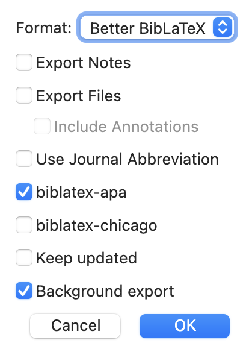

# Quarto and Zotero (or any other reference manager)


## Preface

To include citations in your Quarto projects, you need one or two files, depending on whether you work with the source or visual editor and on the output format you render.

::: aside

More on the visual editor: <https://quarto.org/docs/visual-editor/>

:::

In this example, I assume that you work with the source editor^[I never really use the visual editor, but it has some nice features.]. In practice, it does no harm to provide both files: a `.bib` file containing your references and, preferably, a `.csl` file defining the citation and bibliography style. 

Finally, as the heading suggests, I use Zotero 10 to manage my references, but any reference manager that can export to BibTeX will work. For Zotero, I additionally use the [Better BibTeX plugin](https://retorque.re/zotero-better-bibtex/), mainly because it provides stable citation keys and automatic `.bib`-exports. 

::: aside

Download the plugin from the GitHub repository: <https://github.com/retorquere/zotero-better-bibtex/releases/tag/v9.0.70> 

:::

## .csl file

CSL stands for **C**itation **S**tyle **L**anguage and is an open XML file format that describes schema for the formatting of citations and bibliographies ([wikipedia](https://en.wikipedia.org/wiki/Citation_Style_Language)). In short, a `.csl` file specifies the citation style you want to use such as the [APA STYLE](https://apastyle.apa.org/). The respective `.csl` file (i.e., `apa.csl`) can be downloaded from [Citation Style Language repository on GitHub](https://github.com/citation-style-language/styles) and is typically placed in the root directory of your Quarto project.

::: aside

<https://citationstyles.org/>

:::

```txt
ProjectName/
├── report.qmd # document that combines everything
├── report.pdf # aka rendered report.qmd  
├── README.md # provides a project overview
├── _quarto.yml # Quarto Projects only
├── apa.csl
└── ...
```

If you do not specify a `.csl` file, Quarto uses Pandoc's default citation style,, which is the [Chicago Manual of Style](https://www.chicagomanualofstyle.org/home.html).

## .bib file

The `.bib` file contains the bibliographic information of your references and a single entry (here an article) looks like this:
 
```bibtex
@article{example,
  author = {Doe, John},
  title = {An Example Article},
  journal = {Journal of Examples},
  year = {2020},
  volume = {1},
  number = {1},
  pages = {1-10},
  doi = {10.1234/example.doi}
}
```
 
Reference managers such as Zotero (and others) can export your references in the BibTeX format, which is compatible with Quarto. 

As mentioned above, I use Zotero with the Better BibTeX plugin.  In this setup, you go to your dedicated library in Zotero, right-click on the library, and select ***"Export..."***  and then the following dialog box appears:


{fig-align="center" width="50%"}


If you want to keep your `.bib` file up-to-date with your Zotero library, select the option ***"Keep updated"*** (which I recommend). This will create a `.bib` file that is automatically updated whenever you add or modify references in your Zotero library. After clicking ***"OK"***, you will be prompted to save the `.bib` file. I recommend saving it in the root directory of your Quarto project, as the `.csl` file.


 


