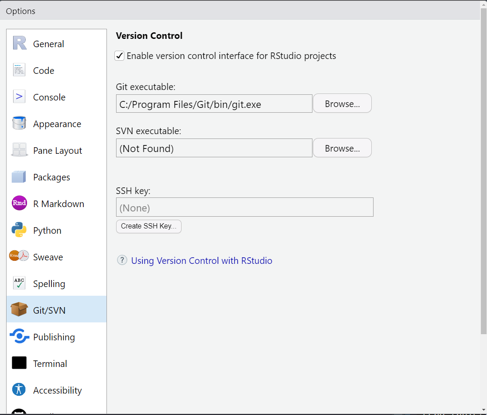
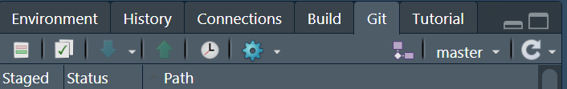
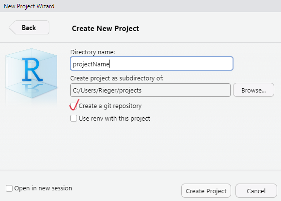
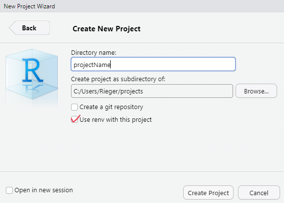
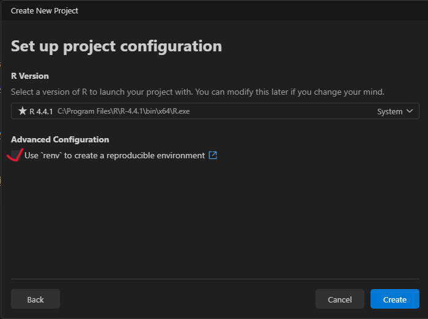

::: {.callout-important}

This chapter is under active development. 


:::


## Prerequisite

To follow this chapter, I assume that you are familiar with the basics of RStudio or Positron, R as a programming language and Quarto as a publishing system. If not, you can check out [Chapter 2](choose-an-ide.qmd): *Choose an IDE*, [Chapter 3](#introduction-to-r): *Introduction to R* and [Chapter 4](#introduction-to-quarto): *A not so short introduction to Quarto*.

## Working Directory

A robust project environment begins with a structured organization of data, code and output files within a working directory. This means, you should create a dedicated project folder with an informative name. The structure of this folder should look anything like in the following example. Different components of a project (i.e., data, code, and output-files) should be stored in separate directories. 

::: aside

`.md` = markdown, `.qmd` = quarto-markdown, `.csv` = comma-separated-values-format, `.png` = portable-network-graphics, `.pdf` = portable-document-format, `yml` = Yet Another Markup Language

:::


```txt
ProjectName/
├── data/
│   ├── raw/ # Original datasets (read-only)
│   │   ├── rawData-1.csv 
│   │   ├── rawData-2.csv 
│   │   └── ...
│   ├── processed/ # Cleaned, processed and final datasets
│   │   ├── 01_dataCleaning.csv
│   │   ├── 02_dataTransformation.csv
│   │   ├── ...
│   │   └── dataToShare.csv
├── code/
│   ├── src/ # reusable (custom) functions, helper utilities
│   │   ├── _functions.r
│   │   └── ...
│   ├── scripts/ # scripts for data processing and analysis
│   │   ├── 01_dataCleaning.qmd
│   │   ├── 02_dataTransformation.qmd
│   │   ├── 03_analysis.qmd
│   │   └── ...
├── output/ # results
│   ├── figures/
│   │   ├── histogram.png
│   │   ├── resultPlot.png
│   │   └── ...
│   ├── tables/
│   │   ├── summaryTable.csv
│   │   └── ...
├── report.qmd # document that combines everything
├── report.pdf # aka rendered report.qmd  
├── images/ # images that need to be included
├── README.md # provides a project overview
├── .gitignore # useful when using Git 
├── _quarto.yml # Quarto Projects only
├── .Rprofile / renv.lock # information about evironment
├── codebook.md
└── ...
```


To further strengthen the reproducibility of the project, adding a `README.md` file at the root of your working directory helps others to understand the structure, and usage of your project.


::: {.callout-important title="No files outside the project folder!" collapse="show"}

Keep all project-related files inside the project folder. This ensures that the project is self-contained and can be shared or moved without breaking file references. This means, within a project, do not *hard-code* absolute paths (e.g., `C:/Users/YourName/Documents/ProjectName/data/raw/...`). Instead, use paths relative to the project root (e.g., `data/raw/...`). Accordingly, using `setwd()` inside project code is usually a sign of *fragile* code, as it introduces a hidden state and makes execution dependent on where and how the code is run.

If you are struggling with file paths, consider using the `here` package [@R-here], which constructs paths relative to the project root in a robust way.

:::

::: {.column-margin}

See also Chapter 3.1: We need to talk about `setwd("path/that/only/works/on/my/machine")` of the online book [What They Forgot to Teach You About R](https://rstats.wtf/projects#sec-setwd)

:::

### Create a working directory (project folder)

The easiest way to create (and manage) a working directory is to use the project feature provided by your IDE. This feature differs between RStudio and Positron. While RStudio uses so-called **R Projects**, Positron uses the Visual Studio Code approach of **workspaces and folders**.


::: {.column-margin}

See also [Chapter 6](https://r4ds.hadley.nz/workflow-scripts.html#projects): Workflow: scripts and projects of the book [R for Data Science]

:::

::: {.callout-caution title="Exercise: Create a working directory through your IDE! (5 min)" collapse="true"}


::: {.panel-tabset}

### RStudio



### Positron



:::

:::

During project initialization, you can choose to create a Git repository and/or to use the `renv` package [@R-renv]. For a reproducible project setup, it is best practice to use both: Git for version control and `renv` for project environment management.

::: {.callout-note title="Git option when creating a project"}

The Git option may not be available if Git is not installed on your system. How to install Git and a (very) brief overview of its functionality can be found below in the section [Version control via Git ](#version-control-git).

:::

### Create (sub)directories (programmatically)

First, create a file (`File > New File > R Script`) and name it, for example, `create_dirs.R`. Next, to efficiently create all (sub)directories, you need to define a character vector that contains all the directories (paths). 

```{r}
#| label: create-subDir-1
#| eval: false
#| output-location: column
#| code-annotations: hover

my_dirs <- c( # <0>
  file.path("data", "raw"), # <1>
  file.path("data", "processed"), # <1>
  file.path("code", "scripts"), # <1>
  file.path("code", "src"), # <1>
  "output", # <2>
  "images" # <2>
)
```

0. Use `c()` function to combine any values into a character vector.
1. The `file.path()` function constructs platform-independent file paths.
2. No subdirectories in these two directories.  

::: {.callout-important appearance="simple" title="These directories will be created in the current working directory!" collapse="true"}

You may want to check the working directory using `getwd()` function. If you created a `R` Project, this is most likely not an issue, because the working directory is set to the project folder.

:::

<!--

Finally, we used a (`for`) loop to iterate over each path and executing the `dir.create()` function. This loop also checks whether each directory already exists to prevent redundant operations. The `recursive = TRUE` argument ensures that all necessary parent directories are created if they do not exist.

```{r}
#| label: create-subDir-2
#| eval: true

helpmecode::create_dirs


```
 


::: {.callout-caution appearance="simple" title="Exercise (10min)" collapse="show"}

Create the directory structure you want to create.

- Adjust the `myFolders` vector accordingly.

- Use the loop to create the (sub)directories (just copy it).

:::


-->


## Version control via Git  {#version-control-git}

### What is version control and why you should use it?

::: aside 

How to start with Git? &rarr; [Book on Git](<https://git-scm.com/book/en/v2>)

:::

Tracking and recording changes for all kind of files (within a project) over time through an additional program

:::: {.columns}
::: {.column width="60%"}

::: {.fragment fragment-index=1}
- **Backup**: Records the history of your project and allows for easy recovery of earlier versions
:::

::: {.fragment}
- **Collaboration**: It allows multiple people to work on the same project without overwriting each other's work.
:::

::: {.fragment}
- **Understanding & Traceability**: It helps to track why changes were made, who made them, and when
:::

:::
::: {.column width="1%"}
:::

::: {.column width="39%"}

::: {.fragment fragment-index=1}
![Time machine analogy^[Image was created with ChatGPT]](../images/chatgpt-time-machine.png){fig-align="left" width=70%}
:::

:::
::::


::: {.fragment }
> “Track Changes” features from Microsoft Word on steroids (<https://happygitwithr.com/big-picture>)
:::


### Git [](<https://git-scm.com>) Basics

:::: {.columns}
::: {.column width="49.5%"}

::: {.fragment .fade-up}
1. **Repository (Repo)**: The place where your project lives. It contains all the files and the entire revision history.
:::
::: {.fragment .fade-up}
2. **Commit**: Making a commit is making a snapshot of your repository at a specific time point. Each commit records the current state of your project and has a unique identifier.
:::
::: {.fragment .fade-up}
3. **Branch**: A branch may be a separate line of project development (e.g., to try out new ideas in a isolated area). The 'main' (or previous 'master') branch is usually considered the definitive branch.
:::
:::
::: {.column width="1%"}
:::
::: {.column width="49.5%"}
::: {.fragment .fade-up}
4. **Merge**: Merging means to incorporate changes from a different branch into the the main branch.
:::
::: {.fragment .fade-up}
5. **Pull Request**: When collaborating, you make changes in your branch and then ask others to review and merge them. This request is called a pull request.
:::
::: {.fragment .fade-up}
6. **Clone**: Making a local copy of a remote repository. 
<!-- For example, creating a repo on GitHub and then clone it to a local folder on your computer. -->
:::

::: {.fragment .fade-up}
7. **Fork**: Copy a project from somebody else without affecting the original project.
:::

:::
::::

::: aside

Happy Git and GitHub for the useR: <https://happygitwithr.com/>

:::


##  Git in IDEs

Download & install Git : <https://git-scm.com/downloads> 

While installing Git on Windows is straightforward (just run `git-current-version.exe`), on macOS it requires an additional step of installing a package manager (here: [Homebrew](<https://brew.sh/>)), before proceeding with the Git installation.


::: {.callout-warning appearance="simple" title="Git installation for macOS only." collapse="true"}

Copy and paste the following comand in a macOS terminal. Follow the steps.

```{bash}
#| eval: false
#| code-line-numbers: false
/bin/bash -c "$(curl -fsSL https://raw.githubusercontent.com/Homebrew/install/HEAD/install.sh)"
```

Then: 

```{bash}
#| eval: false
#| code-line-numbers: false
$ brew install git
```

:::

::: {.panel-tabset}

### Git in RStudio

::: {.panel-tabset}

#### Step 1

1. Go to Tools > Global Options > Git/SVN
2. Click Enable version control interface for RStudio projects
3. If necessary, enter the path for your Git where provided.




It will then appear in the Environment, History, and Connections pane.

{width="80%"}


#### Step 2

Enable it when creating a `R` project: Click 'Create a git repository'



:::

### Git in Positron

Positron usually detects Git [](<https://git-scm.com/downloads>). Because Positron is a fork of the IDE [Visual Studio Code](<https://code.visualstudio.com/>), it has integrated source control management (SCM) and includes Git support. If you encounter any problem, you find help here: <https://code.visualstudio.com/docs/sourcecontrol/overview>

:::

::: aside

After installation, you might want to check the installed version of git. Copy and paste the following comand in the terminal.

```{bash}
#| label: check-git-version
#| eval: false
#| code-line-numbers: false
git --version
```

:::


### Combine it with GitHub 

GitHub provides a home for Git-based projects and allows other people to see the project ... forgejo .. gitlab

## Creating a reproducible environment: The `renv` package

In `R`, the `renv` package [@R-renv] is desigend to create a reproducible environment. 

How does it work? When initiating a project with the `renv` package, it...

- creates a separate library (instead of having one library containing the packages used in all projects) 
   
- creates a lockfile (i.e., `renv.lock`) that records metadata about all packages

- creates a `.Rprofile` file that is automatically run every time you start the project

::: {.callout-warning title="But...no panacea for reproducibility" appearance="simple"}

The `renv` package does not help with the `R` version, `Pandoc` (R Markdown and Quarto rely on pandoc) and the operating system, versions of system libraries, compiler versions.

:::

::: aside

<https://rstudio.github.io/renv/articles/renv.html>

::::

## 

**Recommendation:** Initiate the package when creating a `R` project. Alternativey, call the `renv::init()` function to set up the project infrastructure.

```{r}
#| label: renv-1
#| echo: true
#| eval: false
#| code-line-numbers: false
#| column: margin
renv::init()
```

::: {.panel-tabset}

### RStudio



### Positron

{width="580px" height="415px"}


:::


### `renv.lock`

The `renv.lock` file captures the exact state of an `R` project’s environment (stored as a [**JSON**](<https://en.wikipedia.org/wiki/JSON>)^[From wikipedia: **J**ava**S**cript **O**bject **N**otation is an open standard file format and data interchange format that uses human-readable text to store and transmit data objects consisting of attribute–value pairs and arrays (or other serializable values)] format). 

#### After initialization

```json
{
  "R": {
    "Version": "4.4.1",
    "Repositories": [
      {
        "Name": "CRAN",
        "URL": "https://packagemanager.posit.co/cran/latest"
      }
    ]
  },
  "Packages": {
    "renv": {
      "Package": "renv",
      "Version": "1.0.9",
      "Source": "Repository",
      "Repository": "CRAN",
      "Requirements": [
        "utils"
      ],
      "Hash": "ef233f0e9064fc88c898b340c9add5c2"
    }
  }
}

```

#### Monitoring (used) packages

::: {.callout-caution appearance="simple" title="Exercise (10min)" collapse="false"}

To understand the functionality of the package:

1. Create a `R` script
2. Install any package [e.g., `jsonlite`, @R-jsonlite]
3. Use a function of the package (e.g., `toJSON()`)

```{r}
#| label: install-jsonlite
#| eval: false

renv::install("jsonlite")

jsonlite::toJSON(list(name = "JohnDoe", age = 25))
```

4. Call `renv::snapshot()`:

```{r}
#| label: call-snapshot
#| eval: false

renv::snapshot(type = "implicit") # default
```

:::


The updated `renv.lock` file looks now as follows:

```json
{
  "R": {
    "Version": "4.4.1",
    "Repositories": [
      {
        "Name": "CRAN",
        "URL": "https://packagemanager.posit.co/cran/latest"
      }
    ]
  },
  "Packages": {
    "jsonlite": {
      "Package": "jsonlite",
      "Version": "1.8.9",
      "Source": "Repository",
      "Repository": "CRAN",
      "Requirements": [
        "methods"
      ],
      "Hash": "4e993b65c2c3ffbffce7bb3e2c6f832b"
    },
    "renv": {
      "Package": "renv",
      "Version": "1.0.9",
      "Source": "Repository",
      "Repository": "CRAN",
      "Requirements": [
        "utils"
      ],
      "Hash": "ef233f0e9064fc88c898b340c9add5c2"
    }
  }
}
```


The `renv` package offers more useful functions such as `renv::restore()` or `renv::upodate()` (see the package documentation: <https://rstudio.github.io/renv/articles/renv.html>). 


### `.Rprofile`

In general, the `.Rprofile` file is a user-controllable file that enables the user to set default options (e.g., `options(digits = 4)`) and environment variables either on the user or the project level (see [here](<https://support.posit.co/hc/en-us/articles/360047157094-Managing-R-with-Rprofile-Renviron-Rprofile-site-Renviron-site-rsession-conf-and-repos-conf#:~:text=Rprofile%20files%20are%20user%2Dcontrollable,base%20of%20the%20project%20directory.>)). The `.Rprofile` file is run automatically every time you start `R` or a certain project.

In the context of `renv` package, it sources the `activate.R` script that was created by the `renv` package. Recall, this script is run, everytime you (or somebody else) open(s) the project and creates the project environment (e.g., project-specific library).

```{r}
#| label: content-rprofile
#| eval: false
#| code-line-numbers: false
#| column: margin
source("renv/activate.R")
```


::: {.callout-important appearance="simple" title="Collaboration and the use of version control" collapse="false"}

Ensure that `renv.lock`, `.Rprofile`, `renv/settings.json`, and `renv/activate.R` are commited to version control. Without these files, the environment cannot be recreated.

::::


## Full in: Docker

-- work in progress --