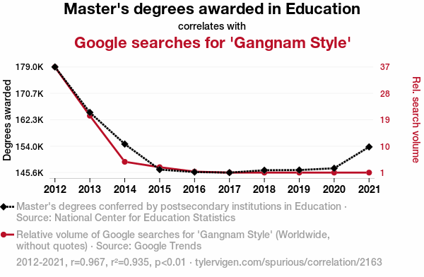

::: {.content-hidden when-profile="slides"}

## Revealjs Presentation {.unnumbered}

If you want to see the presentation in full screen click [here](../_slides/working-with-data/correlation.html).

<div class="container">
  <iframe class="responsive-iframe" src="../_slides/working-with-data/correlation.html"></iframe>
</div> 

:::


::: {.content-hidden unless-profile="slides"}

# Agenda

- [Overview of Correlation Coefficients](#correlation-coefficients)

- [Pearson's Product Moment Correlation Coefficient](#pearson-cor)

- [Correlations in R](#cor-in-r)

::: footer
This is a [`revealjs`](https://revealjs.com/) presentation made with [Quarto](https://quarto.org/).
:::

:::

## What is a Correlation?

> In statistics, correlation is a type of statistical relationship between two random variables or bivariate data. It usually refers to the extent to which a pair of quantities are linearly related. More generally, an arbitrary relationship between variables is called an association, meaning the degree to which the variability in one can be accounted for by the other. [...]

::: aside

Definition retrieved from [Wikipedia](https://en.wikipedia.org/wiki/Correlation) on May, 21, 2026.

:::


## Correlation $\neq$ Causation




::: aside

Correlation is $r = 0.97$, $p < .001$

&nbsp;

[https://tylervigen.com/spurious/correlation](https://tylervigen.com/spurious/correlation/2163_masters-degrees-awarded-in-education_correlates-with_google-searches-for-gangnam-style)

:::

## Overview of Correlation Coefficients

Different types of correlation coefficients exist depending on the scale level and distributional properties of the variables:

::: {.incremental}

- Pearson's product moment correlation
- Spearman's rank correlation coefficient
- Kendall's $\tau$ 
- Cramér's V
- Tetrachoric correlation
- Polychoric correlation
- ...
:::


## Pearson's product moment correlation coefficient

::: {.callout-tip appearance="simple" icon="true"}

The Pearson's product moment correlation coefficient is a statistical measure of the linear relationship between two (continuous) random variables. The formula is given in @eq-cor.

$$
COR(X,Y) = \frac{COV(X,Y)}{SD_XSD_Y} = \frac{\frac{1}{n-1} \sum\limits_{i=1}^{n} (x_i - \bar{x})(y_i - \bar{y})}{\sqrt{\frac{1}{n-1} \sum\limits_{i=1}^n (x_i - \bar{x})^2}\sqrt{\frac{1}{n-1} \sum\limits_{i=1}^n (y_i - \bar{y})^2}}
$${#eq-cor}

The values range from -1 (perfect negative linear) to +1 (perfect positive linear).

The null hypothesis (usually) is  $H_0: \rho = 0$

The formula of the test statistic is given in @eq-tt-cor.

$$
t = \frac{COR \cdot \sqrt{n-2}}{\sqrt{1-COR^2}}  \qquad \text{ with } df = n-2
$${#eq-tt-cor}


:::


::: {.content-hidden unless-profile="slides"}

## By Hand-calculation 

:::

::: {.content-hidden unless-profile="book"}

### By Hand-calculation 

:::

::: {.callout-caution appearance="simple" icon="true" title="Exercise"}

:::: {.columns}

::: {.column width="49%"}

Calculate the Pearson's product moment correlation coefficient for the following data by hand.

Use the formula(s) provided in @eq-cor (i.e., $COV$, $SD_X$, $SD_Y$).

:::

::: {.column width="2%"}

:::

::: {.column width="49%"}


```{r}
#| label: corDemo
#| echo: false
#| code-fold: false
#| 

cor_demo <- data.frame(X = c(1:5),
                      Y = c(1,3,1,5,1),
                      Xm = mean(c(1:5)),
                      Ym = mean(c(1,3,1,5,1)))
cor_demo_tab <- knitr::kable(cor_demo,
                           col.names = c("X",
                                         "Y",
                                         "$\\overline{X}$",
                                         "$\\overline{Y}$"))
cor_demo_tab
```

:::

::::

:::

::: {.content-hidden unless-profile="slides"}

## 4 Steps to Calculate Pearson's Correlation Coefficient

:::


::: {.panel-tabset}

### Step 1: Covariance between $X$ and $Y$


$$
\begin{aligned}
COV_{XY}
&=
\frac{1}{n-1}
\sum_{i=1}^{n}
(x_i-\bar{x})(y_i-\bar{y})
\\[0.5em]
&=
\frac{
(1-3) \cdot (1-2.2)
+
(2-3) \cdot (3-2.2)
+
(3-3) \cdot (1-2.2)
}{
4
}
\\
&\quad +
\frac{
(4-3) \cdot (5-2.2)
+
(5-3) \cdot (1-2.2)
}{
4
}
\\[0.5em]
&=
0.5
\end{aligned}
$$


### Step 2: Standard Deviation of $X$ 

 
$$
\begin{aligned}
SD_X &= \sqrt{\frac{1}{n-1} \sum\limits_{i=1}^n (x_i - \bar{x})^2} \\&= \sqrt{\frac{(1-3)^2+(2-3)^2+(3-3)^2+(4-3)^2+(5-3)^2}{4}} \\&= 1.58
\end{aligned}
$$

### Step 3: Standard Deviation of $Y$

$$
\begin{aligned}
SD_Y &= \sqrt{\frac{1}{n-1} \sum\limits_{i=1}^n (y_i - \bar{y})^2} \\&= \sqrt{\frac{(1-2.2)^2+(3-2.2)^2+(1-2.2)^2+(5-2.2)^2+(1-2.2)^2}{4}} \\&= 1.79
\end{aligned}
$$


### Step 4: Pearson's Correlation Coefficient 


$$
\begin{aligned}
COR_{XY} &= \frac{COV(X,Y)}{SD_XSD_Y} \\ &= \frac{0.5}{1.58 \cdot 1.79} \\& = 0.18
\end{aligned}
$$

### Optional: Quick Check in R

```{r}
#| label: quick-cor-check
#| eval: true
#| echo: true
#| code-fold: false
#| output-location: column
with(cor_demo,
      list(COV = cov(x = X, y = Y),
           SDX = sd(X),
           SDY = sd(Y),
           COR = cor(x = X,y = Y))
      )
```

:::

